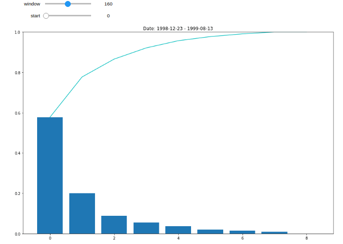

# PCA
* Using returns from S&P 500 Sector ETF's the first notebook (PCA.ipynb) performs a Principal Components analysis along with various visualizations

* The second notebook (PCA_Scratch.ipynb) manually calculates eigenvectors and eigenvalues of the same problem

* Visualization of PCA through time 

